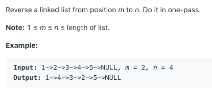
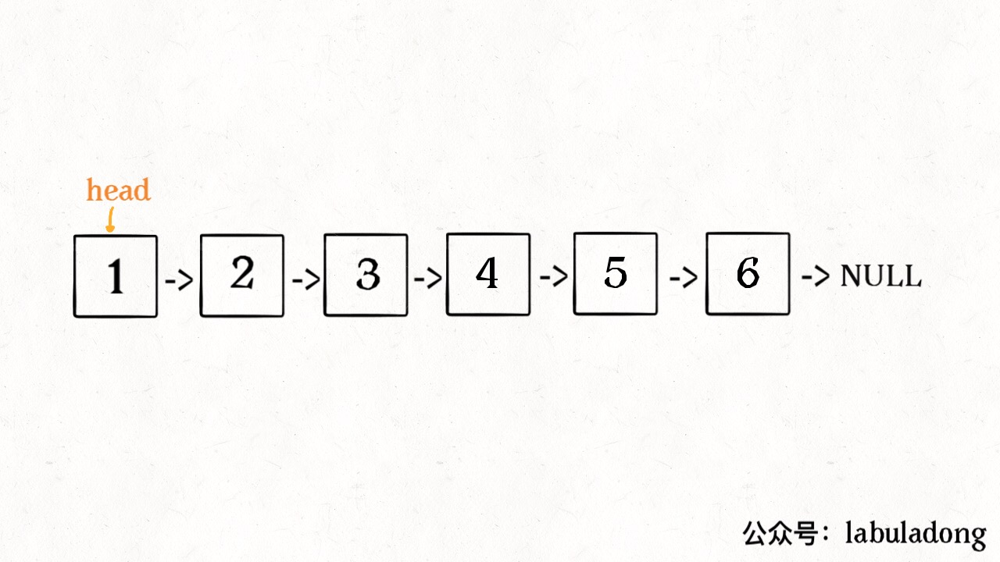
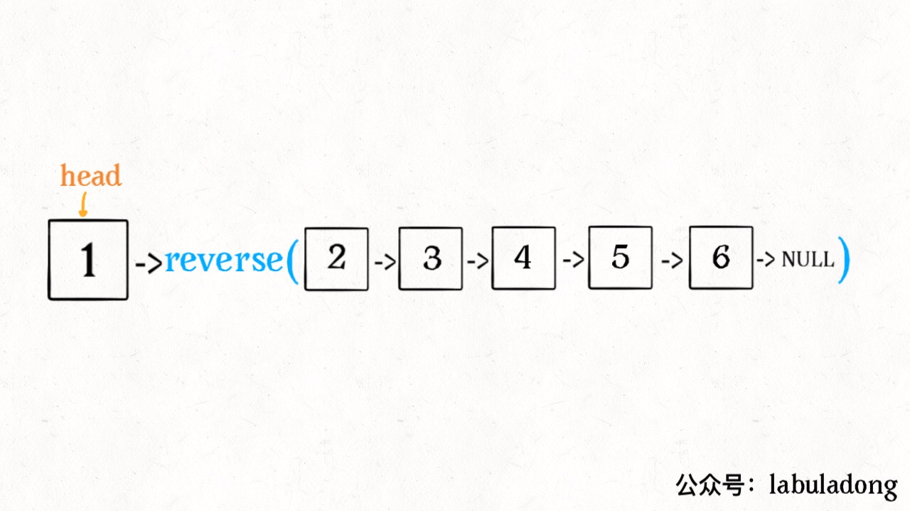
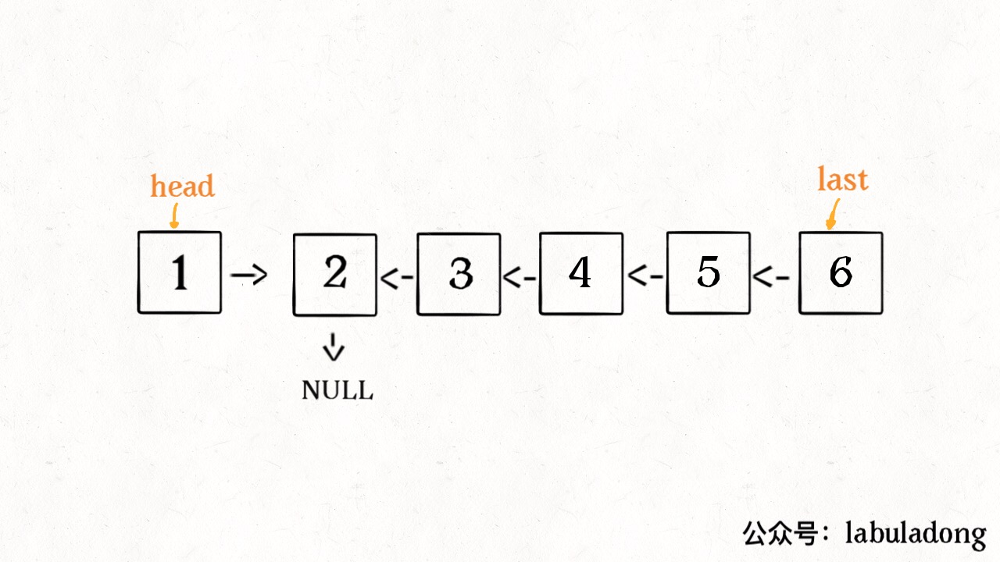
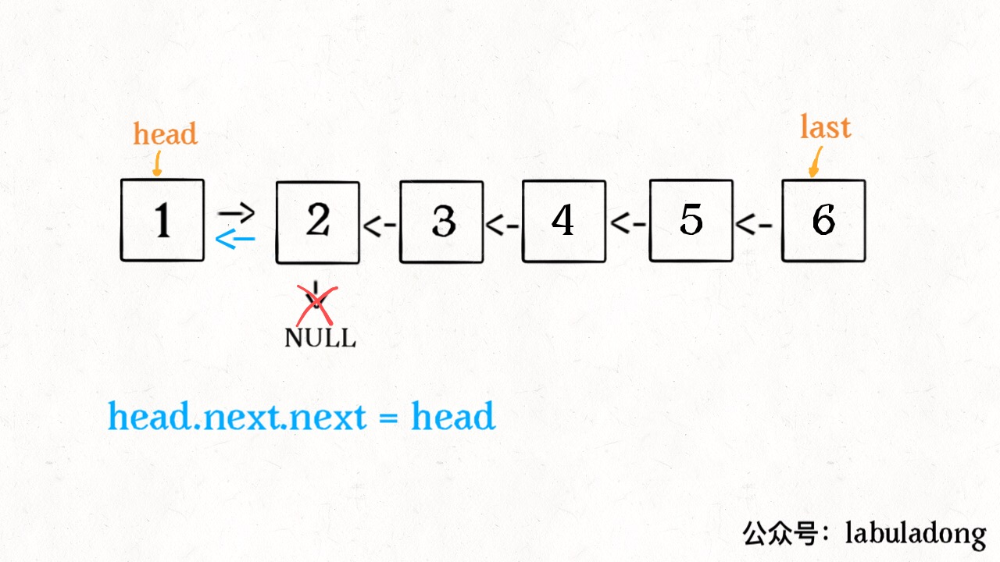
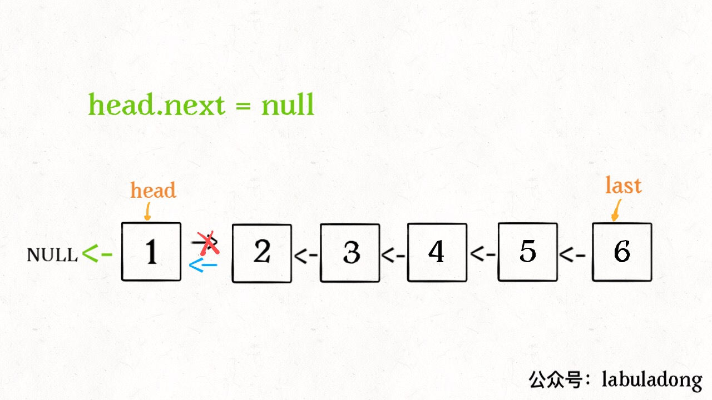
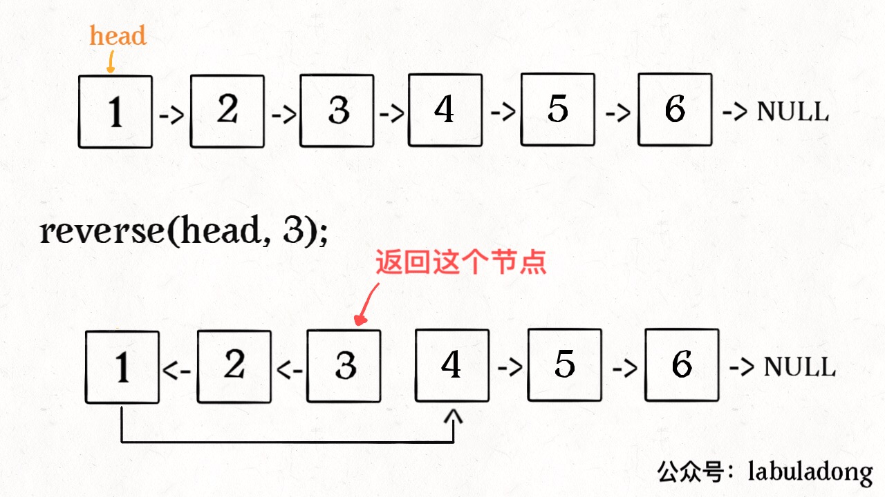
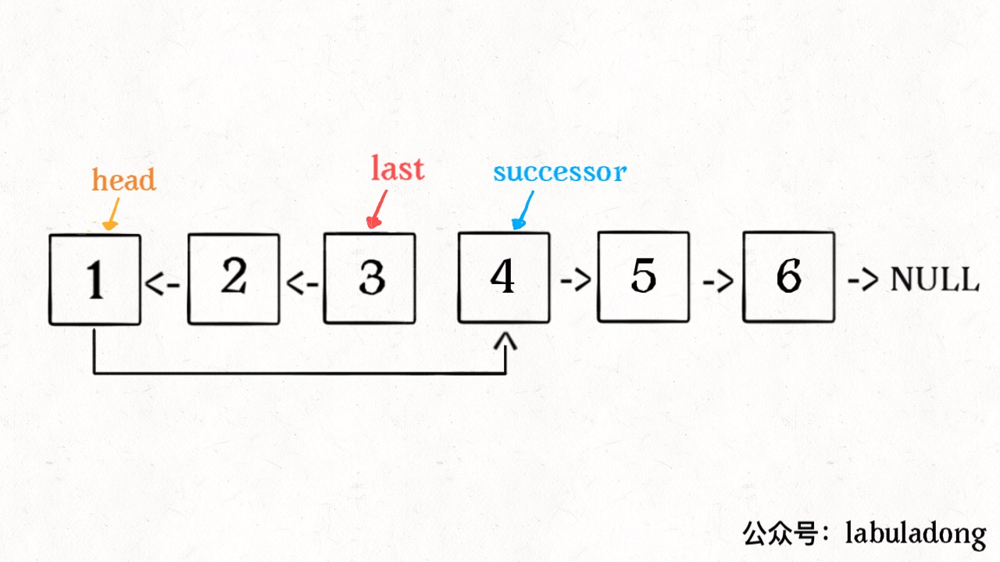

# Reverse Part of a Linked List via Recusion

**Author: [labuladong](https://github.com/labuladong)**

**Translator: [CarrieOn](https://github.com/CarrieOn)**

It's easy to reverse a single linked list using iteration, however it's kind of difficult to come up with a recursive solution. Furthermore, if only part of a linked list needs reversed, can you nail it with **recursion**?

If you haven't known how to **recursively reverse a single linked list**, no worry, we will start right here and guide you step by step to a deeper level.

```java
// node structure for a single linked list 
public class ListNode {
    int val;
    ListNode next;
    ListNode(int x) { val = x; }
}
```
<br>

To reverse part of a linked list means we only reverse elements in a specific interval and leave others untouched.



Note: **Index starts from 1**. Two loops needed if solve via iteration: use one for-loop to find the mth element, and then use another for-loop to reverse elements between m and n. While in recursive solution, no loop at all. 

Though iterative solution looks simple, you have to be careful with the details. On the contrary, recursive solution is quite elegant. Let's start reversing a whole single linked list in the recursive way.

### 1. Recursively reverse a whole single Linked List

You may have already known the solution below.

```java
ListNode reverse(ListNode head) {
    if (head.next == null) return head;
    ListNode last = reverse(head.next);
    head.next.next = head;
    head.next = null;
    return last;
}
```
Do you feel lost in trying to understand code above? Well, you are not the only one. This algorithm is often used to show how clever and elegant recursion can be. Let's dig into the code together.

For recursion, **the most important thing is to clarify the definition of the recursive function**. Specifically, we define `reverse` as follows:

**Input a node `head`, we will reverse the list starting from `head`, and return the new head node.**

After clarifying the definition, we look back at the problem. For example, we want to reverse the list below:



So after calling `reverse(head)`, recursion happens:

```java
ListNode last = reverse(head.next);
```
Did you just step into the messy details in recursion? Oops, it's a wrong way, step back now! Focus on the recursion definition (which tells you what it does) to understand how recursive code works the wonder.



After executing `reverse(head.next)`, the whole linked list becomes this:



According to the definition of the recursive function, `reverse` needs to return the new head node, so we use variable `last` to mark it. 

Let's continue cracking the next piece of code:

```java
head.next.next = head;
```



Last work to do：

```java
head.next = null;
return last;
```



The whole linked list is successfully reversed now. Amazing, isn't it? 

Last but not the least, there are two things in recursion you need to pay attention to:

1. Recursion needs a base case.
	
	```java
	if(head.next == null) return head;
	```
	
	which means when there is only one node, after reversion, the head is still itself.
2. After reversion, the new head is `last`, and the former `head` becomes the last node, don't forget to point its tail to null.

	```java
	head.next = null;
	```
	
After understanding above, now we can proceed further, the problem below is actually an extend to the above solution.

### 2. Reverse first N nodes

This time we will implement a funtion below:

```java
// reverse first n nodes in a linked list (n <= length of the list)
ListNode reverseN(ListNode head, int n)
```
Take below as an example, call `reverseN(head, 3)`:



The idea is similar to reversing the whole linked list, only a few modifications needed:

```java
ListNode successor = null; // successor node

// reverse n nodes starting from head, and return new head
ListNode reverseN(ListNode head, int n) {
    if (n == 1) { 
        // mark the (n + 1)th node
        successor = head.next;
        return head;
    }
    // starts from head.next, revers the first n - 1 nodes
    ListNode last = reverseN(head.next, n - 1);

    head.next.next = head;
    // link the new head to successor
    head.next = successor;
    return last;
}    
```

Main differences:

1. Base case `n == 1`, if reverse only one element, then new head is itself, meanwhile **remember to mark the successor node**.
2. In previouse solution, we set `head.next` directly to null, because after reversing the whole list, head becoms the last node. But now `head` may not be the last node after reversion, so we need mark `successor` (the (n+1)th node), and link it to `head` after reversion.



OK, now we are pretty close to reversing part of the linked list.

### 3. Reverse part of a linked list

Given an interval `[m,n]` (index starts from 1), only reverse elements in this section.

```java
ListNode reverseBetween(ListNode head, int m, int n)
```

First, if `m == 1`, it is equal to reversing the first `n` elements as we discussed just now.


```java
ListNode reverseBetween(ListNode head, int m, int n) {
    // base case
    if (m == 1) {
        // equals to reversing the first n nodes
        return reverseN(head, n);
    }
    // ...
}
```
What if `m != 1`? If we take the index of the `head` as 1, then we need to reverse from the `mth` element. And what if we take the index of the `head.next` as 1? Then compared to `head.next`, the reverse section should start from `(m-1)th` element. And what about `head.next.next` ...

Different from iteration, this is how we think in the recursive way, so our code should be:

```java
ListNode reverseBetween(ListNode head, int m, int n) {
    // base case
    if (m == 1) {
        return reverseN(head, n);
    }
    head.next = reverseBetween(head.next, m - 1, n - 1);
    return head;
}
```
Finally, we solved the problem we have talked about at the very beginning, happy ending!

### 4. Summary

Compared to iteration, it is a little bit difficult to understand recursion, the tricks are: never bury yourself in the details, just focus on its clear definition, thus to gain a quick understanding of how it works and what it outputs.

For time complexity, iteration is O(1) while recursion is always O(N). For space complexity, iteration needs O(N) while recursion needs stack. Overall, iteration has a better performance. Solutions in this article provides you a good way to learn recursion.

**Mission**: Stick to original high quality articles, and make algorithms easy to understand. Welcome to subscribe my Wechat public account `ID:labuladong` for latest articles.